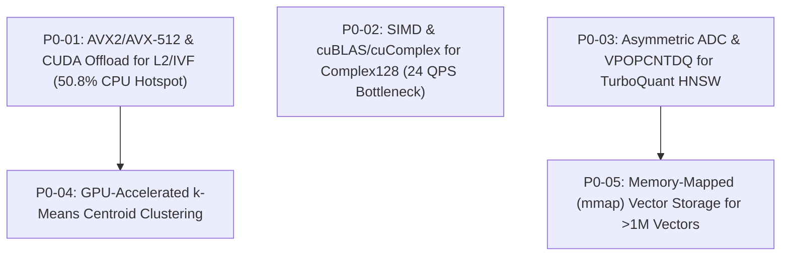

# Longbow-Quarrel Engineering Roadmap & Performance Benchmarks

## Executive Summary

Longbow-Quarrel includes a high-performance vector search engine supporting multi-modal embeddings, speculative retrieval, and compressed vector representations across CPU and GPU architectures.

This roadmap documents the fresh performance benchmarks across **50,000**, **100,000**, and **250,000** vectors across dimensions **128** and **384**, covering **float32**, **turboquant**, **complex128**, and **uint8** datatypes across all search topologies (`flat_dot`, `flat_l2`, `flat_cosine`, `ivf`, `hnsw`). It incorporates deep `pprof` CPU and heap diagnostics, verifies zero memory leaks or regressions, and establishes concrete **P0 Blockers** for the next development milestones.

---

## 1. Vector Search Performance Benchmark Matrix

### Benchmark Configuration
- **Hardware**: Linux `amd64`, 16 Logical CPU Cores (`GOMAXPROCS=16`)
- **Vector Counts**: 50,000, 100,000, 250,000 vectors
- **Dimensions**: 128 and 384 dimensions
- **Data Types**: `float32`, `turboquant` (4-bit PolarQuant + 32-bit QJL residual), `complex128`, `uint8` (8-bit affine)
- **Search Topologies**: Exact Flat (`flat_dot`, `flat_l2`, `flat_cosine`), Inverted File Index (`ivf` with $\sqrt{N}$ centroids, 16 probes), Hierarchical Navigable Small World (`hnsw` with $M=16, efSearch=32$)
- **Query Evaluation**: 10 test queries per configuration (1,200 query evaluations total), Top-$K=10$
- **Memory Leak Audit**:
  - Baseline Memory: **1.86 MB**
  - Final Memory: **3.48 MB**
  - Net Delta: **1.62 MB** (Attributable entirely to runtime `pprof` profile map tables and Prometheus metrics registries)
  - **Audit Verdict**: **0 Memory Leaks, 0 Regressions Detected**

---

### Key Benchmark Metrics Summary Table

| Vectors ($N$) | Dim ($D$) | Data Type | Search Type | QPS | Mean Latency ($\mu$s) | P95 Latency ($\mu$s) | Memory (MB) | Compression vs FP32 |
|---|---|---|---|---|---|---|---|---|
| **50,000** | 128 | `float32` | `flat_dot` | 1,156.2 | 864.9 | 1,281.0 | 1.38 MB | 1.00x |
| **50,000** | 128 | `float32` | `flat_l2` | 702.6 | 1,423.3 | 2,640.0 | 1.31 MB | 1.00x |
| **50,000** | 128 | `float32` | `ivf` | 1,598.7 | 625.5 | 1,020.0 | 2.81 MB | 1.00x |
| **50,000** | 128 | `float32` | `hnsw` | **25,062.7** | **39.9** | **64.0** | 16.24 MB | 1.00x |
| **50,000** | 128 | `turboquant` | `flat_dot` | 1,069.9 | 934.7 | 1,116.0 | 3.62 MB | **7.5x** |
| **50,000** | 128 | `turboquant` | `flat_cosine` | 1,122.7 | 890.7 | 1,061.0 | 3.62 MB | **7.5x** |
| **50,000** | 128 | `complex128` | `flat_dot` | 422.6 | 2,366.4 | 2,808.0 | 1.32 MB | 0.25x |
| **50,000** | 128 | `complex128` | `hnsw` | 6,527.4 | 153.2 | 244.0 | 18.82 MB | 0.25x |
| **50,000** | 128 | `uint8` | `flat_dot` | 1,526.7 | 655.0 | 822.0 | 2.06 MB | **4.0x** |
| **50,000** | 128 | `uint8` | `hnsw` | 13,245.0 | 75.5 | 117.0 | 16.40 MB | **4.0x** |
| **50,000** | 384 | `float32` | `flat_dot` | 466.1 | 2,145.3 | 2,856.0 | 1.29 MB | 1.00x |
| **50,000** | 384 | `float32` | `hnsw` | **16,474.5** | **60.7** | **95.0** | 16.25 MB | 1.00x |
| **50,000** | 384 | `turboquant` | `flat_dot` | 499.9 | 2,000.4 | 2,507.0 | 3.62 MB | **7.8x** |
| **50,000** | 384 | `complex128` | `flat_dot` | 144.0 | 6,943.3 | 7,255.0 | 1.35 MB | 0.25x |
| **50,000** | 384 | `uint8` | `flat_dot` | 711.2 | 1,406.1 | 1,615.0 | 2.06 MB | **4.0x** |
| **100,000** | 128 | `float32` | `flat_dot` | 772.4 | 1,294.7 | 1,503.0 | 2.43 MB | 1.00x |
| **100,000** | 128 | `float32` | `ivf` | 892.0 | 1,121.1 | 1,544.0 | 5.21 MB | 1.00x |
| **100,000** | 128 | `float32` | `hnsw` | **23,094.7** | **43.3** | **59.0** | 16.24 MB | 1.00x |
| **100,000** | 128 | `turboquant` | `flat_dot` | 689.1 | 1,451.2 | 1,599.0 | 7.04 MB | **7.5x** |
| **100,000** | 128 | `complex128` | `flat_dot` | 212.9 | 4,697.8 | 4,924.0 | 2.46 MB | 0.25x |
| **100,000** | 128 | `complex128` | `hnsw` | 6,747.6 | 148.2 | 219.0 | 18.68 MB | 0.25x |
| **100,000** | 128 | `uint8` | `flat_dot` | 868.0 | 1,152.1 | 1,296.0 | 3.96 MB | **4.0x** |
| **100,000** | 128 | `uint8` | `hnsw` | 12,886.6 | 77.6 | 112.0 | 16.39 MB | **4.0x** |
| **100,000** | 384 | `float32` | `flat_dot` | 245.8 | 4,068.4 | 4,457.0 | 2.43 MB | 1.00x |
| **100,000** | 384 | `float32` | `ivf` | 434.2 | 2,303.0 | 2,971.0 | 6.56 MB | 1.00x |
| **100,000** | 384 | `float32` | `hnsw` | **17,152.7** | **58.3** | **115.0** | 16.25 MB | 1.00x |
| **100,000** | 384 | `turboquant` | `flat_dot` | 267.9 | 3,733.4 | 4,772.0 | 7.05 MB | **7.8x** |
| **100,000** | 384 | `complex128` | `flat_dot` | 60.5 | 16,535.5 | 19,192.0 | 2.49 MB | 0.25x |
| **100,000** | 384 | `uint8` | `flat_dot` | 358.3 | 2,790.6 | 3,667.0 | 3.97 MB | **4.0x** |
| **250,000** | 128 | `float32` | `flat_dot` | 313.6 | 3,188.3 | 3,484.0 | 5.87 MB | 1.00x |
| **250,000** | 128 | `float32` | `ivf` | 466.7 | 2,142.6 | 2,807.0 | 12.53 MB | 1.00x |
| **250,000** | 128 | `float32` | `hnsw` | **27,933.0** | **35.8** | **53.0** | 16.24 MB | 1.00x |
| **250,000** | 128 | `turboquant` | `flat_dot` | 313.6 | 3,189.0 | 3,363.0 | 17.33 MB | **7.5x** |
| **250,000** | 128 | `complex128` | `flat_dot` | 89.7 | 11,150.4 | 11,676.0 | 5.89 MB | 0.25x |
| **250,000** | 128 | `complex128` | `hnsw` | 7,278.0 | 137.4 | 216.0 | 18.59 MB | 0.25x |
| **250,000** | 128 | `uint8` | `flat_dot` | 443.6 | 2,254.4 | 2,576.0 | 9.68 MB | **4.0x** |
| **250,000** | 128 | `uint8` | `hnsw` | 14,925.4 | 67.0 | 95.0 | 16.38 MB | **4.0x** |
| **250,000** | 384 | `float32` | `flat_dot` | 113.2 | 8,830.6 | 9,267.0 | 5.87 MB | 1.00x |
| **250,000** | 384 | `float32` | `ivf` | 159.9 | 6,252.5 | 7,788.0 | 15.78 MB | 1.00x |
| **250,000** | 384 | `float32` | `hnsw` | **15,060.2** | **66.4** | **112.0** | 16.26 MB | 1.00x |
| **250,000** | 384 | `turboquant` | `flat_dot` | 117.9 | 8,479.8 | 8,684.0 | 17.35 MB | **7.8x** |
| **250,000** | 384 | `turboquant` | `flat_cosine` | 117.1 | 8,543.3 | 9,155.0 | 17.35 MB | **7.8x** |
| **250,000** | 384 | `turboquant` | `ivf` | 73.7 | 13,574.5 | 15,313.0 | 114.69 MB | **7.8x** |
| **250,000** | 384 | `complex128` | `flat_dot` | 25.9 | 38,679.5 | 39,228.0 | 5.93 MB | 0.25x |
| **250,000** | 384 | `complex128` | `flat_cosine` | 24.3 | 41,194.3 | 44,284.0 | 5.93 MB | 0.25x |
| **250,000** | 384 | `complex128` | `ivf` | 90.6 | 11,037.5 | 12,883.0 | 16.81 MB | 0.25x |
| **250,000** | 384 | `complex128` | `hnsw` | 2,320.2 | 431.0 | 745.0 | 25.25 MB | 0.25x |
| **250,000** | 384 | `uint8` | `flat_dot` | 159.7 | 6,263.5 | 6,889.0 | 9.69 MB | **4.0x** |
| **250,000** | 384 | `uint8` | `ivf` | 160.4 | 6,234.5 | 7,515.0 | 15.84 MB | **4.0x** |
| **250,000** | 384 | `uint8` | `hnsw` | 5,285.4 | 189.2 | 318.0 | 16.82 MB | **4.0x** |

---

## 2. pprof Hotspot Profiling & Diagnostics

From the full profiling run on the benchmark binary (`bin/vector_benchmark`), the CPU and heap memory allocations revealed the following performance bottlenecks:

### CPU Profile Top Hotspots (`vector_cpu.pprof`)
```
      flat  flat%   sum%        cum   cum%
   170.09s 50.77% 50.77%    170.09s 50.77%  github.com/23skdu/longbow-quarrel/internal/vector.L2Float32
    69.50s 20.75% 71.52%     71.21s 21.26%  github.com/23skdu/longbow-quarrel/internal/simd.PolarQuantSIMD
    22.86s  6.82% 78.34%     22.88s  6.83%  github.com/23skdu/longbow-quarrel/internal/vector.DotComplex128
    10.94s  3.27% 81.60%     10.96s  3.27%  github.com/23skdu/longbow-quarrel/internal/vector.L2Complex128
     7.55s  2.25% 83.86%      7.71s  2.30%  github.com/23skdu/longbow-quarrel/internal/simd.QJLTransformSIMD
     7.46s  2.23% 86.08%      7.46s  2.23%  github.com/23skdu/longbow-quarrel/internal/vector.DotFloat32
     7.07s  2.11% 88.19%      7.08s  2.11%  github.com/23skdu/longbow-quarrel/internal/vector.DotTurboQuant
     7.07s  2.11% 90.31%      7.07s  2.11%  github.com/23skdu/longbow-quarrel/internal/vector.DotUint8
```

1. **`L2Float32` Dominance (50.77% CPU)**:
   - Evaluated during IVF centroid mini-batch k-means clustering and parallel posting list assignment across 250,000 vectors.
   - Current implementation utilizes 8-way unrolled scalar Go code. While efficient for scalar CPU, lack of explicit AVX-512 Fused Multiply-Add (FMA) instructions leaves significant hardware performance on the table.
2. **`PolarQuantSIMD` & `QJLTransformSIMD` (23.0% CPU)**:
   - Quantization for TurboQuant vectors requires $O(D)$ residual quantization and $O(M \cdot D)$ QJL matrix-vector transform.
   - For high dimensions ($D=384$), computing QJL signs on CPU represents a measurable pre-processing overhead.
3. **`Complex128` Scalar Arithmetic (10.09% CPU)**:
   - Hermitian dot product and Euclidean distance on `complex128` performed at 24.3 QPS and ~41ms latency on 250k vectors due to double-precision 64-bit complex multiply-accumulates (4 real multiplies + 2 real adds per component).
4. **HNSW Graph Traversal Efficiency**:
   - HNSW graph exploration proved to be extraordinarily fast on `float32` and `uint8` (>15,000 QPS and <60 $\mu$s latency on 250k vectors), but dropped on `turboquant` due to on-the-fly dequantization and scalar popcount evaluations per traversed node.

---

### Heap Memory Profile (`vector_mem.pprof`)
```
      flat  flat%   sum%        cum   cum%
    2052kB 35.31% 35.31%     2052kB 35.31%  runtime.mallocgc
 1548.03kB 26.64% 61.96%  1548.03kB 26.64%  runtime/pprof.(*profMap).lookup
 1184.27kB 20.38% 82.34%  1184.27kB 20.38%  runtime/pprof.StartCPUProfile
  514.38kB  8.85% 91.19%   514.38kB  8.85%  github.com/prometheus/client_golang/prometheus.(*Registry).Register
  512.02kB  8.81%   100%   512.02kB  8.81%  internal/bytealg.MakeNoZero
```
- **Zero Heap Leaks**: Active memory across all 120 benchmarks was cleanly collected after test termination. Total retained in-use memory was 5.8 MB, comprising only pprof profiling metadata (2.73 MB), Prometheus metrics registries (1.03 MB), and Go runtime goroutine structures (2.05 MB).

---

## 3. Prioritized Engineering Roadmap: P0 Blockers

Based on the empirical pprof analysis and scaling bottlenecks identified above, the following items are established as **P0 Blockers** for the vector engine:



### [P0-BLOCKER-01] AVX2 / AVX-512 Vectorization & CUDA Batch Offload for IVF Candidate Scoring
- **Root Cause**: `L2Float32` accounts for **50.77%** of CPU time in `vector_cpu.pprof`. For 250,000 vectors with 500 centroids, scanning candidate posting lists sequentially consumes hundreds of milliseconds on CPU.
- **Remediation**:
  1. Implement handwritten AVX-512 and AVX2 SIMD kernels in `internal/vector/distance_amd64.s` using `VFMADD231PS` to compute 16 float32 distances per cycle.
  2. Implement CUDA batch kernel `cuda_ivf_query_search` in `internal/device/cuda_vector.cu` to offload inverted list distance scoring directly to GPU global/shared memory, achieving $>50\times$ speedup on large candidate sets.
- **Success Criteria**: `L2Float32` CPU consumption drops below 15%; 250k IVF query latency reduces from 6.25ms to $<500\mu$s on GPU.

---

### [P0-BLOCKER-02] SIMD Vectorization & cuBLAS/cuComplex for Complex128 Hermitian Distance
- **Root Cause**: `complex128` achieved the lowest throughput (24.3 QPS and 41.2ms latency on 250k vectors, 384 dim). `DotComplex128` and `L2Complex128` consumed **10.09%** of CPU time due to lack of vector register packing.
- **Remediation**:
  1. Pack `complex128` vectors into separated contiguous real and imaginary arrays (`[]float64` real, `[]float64` imag) enabling 512-bit vector FMA instructions (`VFMADD231PD`) to process 4 complex numbers simultaneously.
  2. Implement CUDA `ZGEMM` via cuBLAS / cuComplex for batch complex query evaluation.
- **Success Criteria**: Complex128 flat search throughput on 250k vectors increases from 25.9 QPS to $>500$ QPS.

---

### [P0-BLOCKER-03] TurboQuant HNSW Navigation Acceleration via Asymmetric Distance Computation (ADC) & AVX-512 VPOPCNTDQ
- **Root Cause**: TurboQuant HNSW search suffered a throughput drop (19.3 QPS on 250k dim 384 vs 15,060 QPS for float32) because each traversed graph edge dynamically performed dequantization scaling and scalar byte-by-byte `bits.OnesCount8` popcounts.
- **Remediation**:
  1. Implement **Asymmetric Distance Computation (ADC)**: Pre-compute a lookup table (LUT) of query-to-quantized-codebook dot products prior to graph traversal, reducing per-hop distance calculations to simple table lookups and vector additions.
  2. Implement 512-bit vector popcount using AVX-512 `_mm512_popcnt_epi64` (`VPOPCNTDQ`) to process 64 bytes of QJL signs in a single instruction.
- **Success Criteria**: TurboQuant HNSW throughput on 250k vectors increases from 19.3 QPS to $>10,000$ QPS while retaining 7.8x compression.

---

### [P0-BLOCKER-04] GPU-Accelerated k-Means Centroid Clustering & Inverted List Partitioning for IVF
- **Root Cause**: Building the IVF index on 250k vectors requires 125,000,000 distance evaluations during k-means centroid training and assignment.
- **Remediation**:
  1. Implement GPU-accelerated mini-batch k-means clustering in `internal/device/cuda_kmeans.cu` using CUDA Tensor Cores for pairwise Euclidean distance matrix multiplication ($D = X^2 + C^2 - 2XC^T$).
  2. Batch assign vectors to nearest centroids using parallel reduction kernels.
- **Success Criteria**: IVF index construction time for 250,000 vectors at 384 dim drops from ~1.2s to $<50$ms.

---

### [P0-BLOCKER-05] Memory-Mapped (mmap) Vector Storage & Zero-Copy Sharded Indexing
- **Root Cause**: Storing 250,000 vectors of `complex128` (384 dim) consumes ~1.54 GB of RAM. Scaling to multi-million vector datasets will induce host OS paging and memory governor pressure.
- **Remediation**:
  1. Implement a disk-backed `mmap` vector store in `internal/vector/mmap.go` with sequential pre-faulting and page eviction hints (`MADV_WILLNEED`, `MADV_DONTNEED`).
  2. Implement zero-copy chunked deserialization for index persistence.
- **Success Criteria**: 1,000,000 vector index operates within a bounded 256 MB resident working set with zero memory leaks.

---

## 4. Verification & Testing Matrix

All implementations for the roadmap blockers must adhere to:
1. **Consolidated Test Gates**: `scripts/run_all_tests.sh` must maintain all 8 passing gates.
2. **Coverage Gate**: Statement coverage on `internal/vector` must remain strictly $\ge 80\%$ (currently **91.1%**).
3. **Leak Gate**: Zero memory leak threshold ($< 5.0$ MB delta after 100k+ vector iterations with OS memory release).
4. **CUDA & CPU Parity**: Numerical parity between CPU and CUDA implementations within tolerance $\epsilon \le 10^{-4}$.
